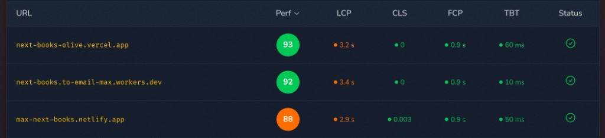
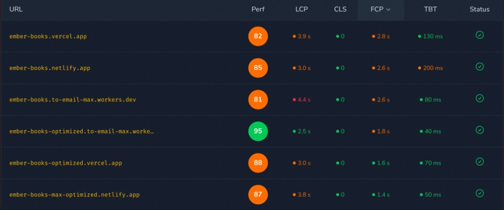
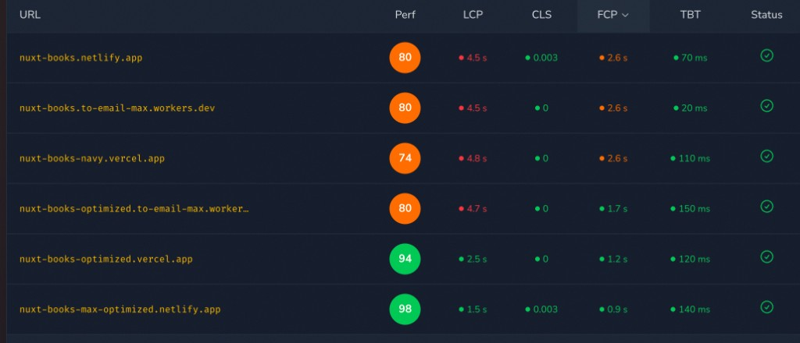
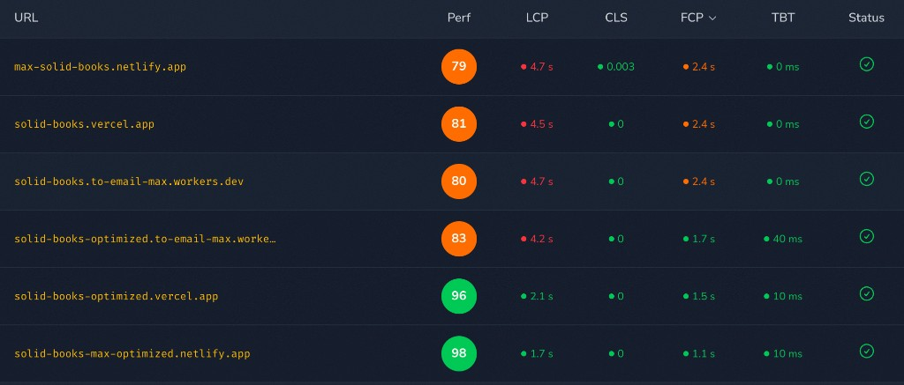
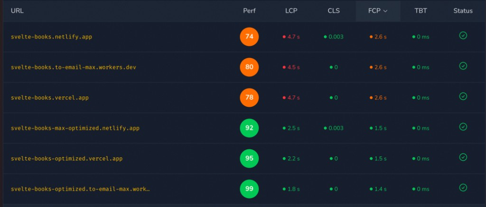
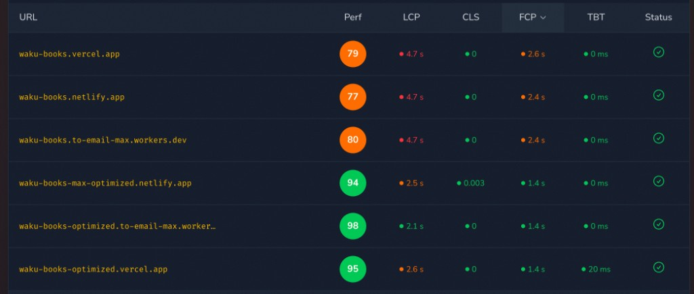
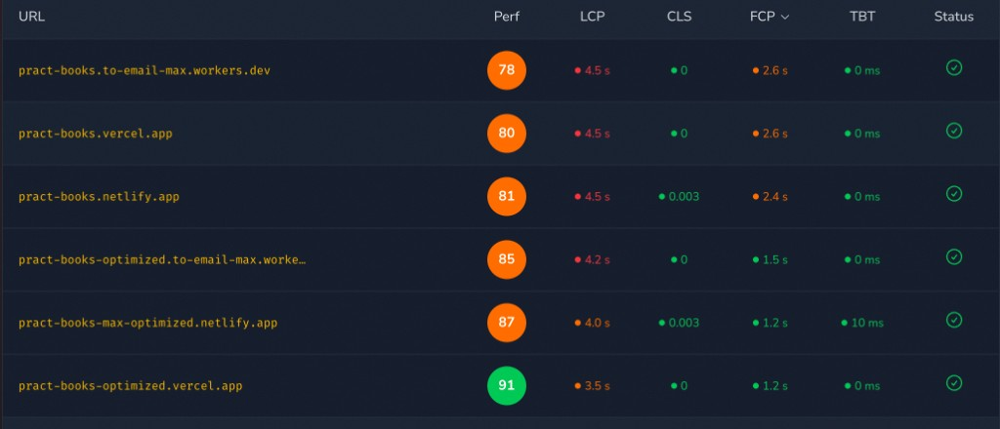

# Books Demo

The same Goodreads catalog app, ported across frameworks. This repo is the launch page for that comparison. Each app lives in its own GitHub repository with its own CI and deploys.

Vite-based ports ship **two** hosted versions on each provider:

- `main` — baseline app (pre cache / font optimizations)
- `optimized` — cache + self-hosted Geist fonts

`next-books` stays a single production deploy on `main`.

| App          | Framework       | Source                                                                    | Branch      | Vercel                                                                         | Netlify                                                                                  | Cloudflare                                                                                                 | Notes                                                               |
| ------------ | --------------- | ------------------------------------------------------------------------- | ----------- | ------------------------------------------------------------------------------ | ---------------------------------------------------------------------------------------- | ---------------------------------------------------------------------------------------------------------- | ------------------------------------------------------------------- |
| next-books   | Next.js         | [MaxwellCohen/next-books](https://github.com/MaxwellCohen/next-books)     | `main`      | [next-books-olive.vercel.app](https://next-books-olive.vercel.app)             | [max-next-books.netlify.app](https://max-next-books.netlify.app)                         | [next-books.to-email-max.workers.dev](https://next-books.to-email-max.workers.dev)                         | fork from work by [aurorascharff](https://github.com/aurorascharff) |
| ember-books  | Ember           | [MaxwellCohen/ember-books](https://github.com/MaxwellCohen/ember-books)   | `main`      | [ember-books.vercel.app](https://ember-books.vercel.app)                       | [ember-books.netlify.app](https://ember-books.netlify.app)                               | [ember-books.to-email-max.workers.dev](https://ember-books.to-email-max.workers.dev)                       | vibe port                                                           |
| ember-books  | Ember           | same                                                                      | `optimized` | [ember-books-optimized.vercel.app](https://ember-books-optimized.vercel.app)   | [ember-books-max-optimized.netlify.app](https://ember-books-max-optimized.netlify.app)   | [ember-books-optimized.to-email-max.workers.dev](https://ember-books-optimized.to-email-max.workers.dev)   | cache + fonts                                                       |
| nuxt-books   | Nuxt            | [MaxwellCohen/nuxt-books](https://github.com/MaxwellCohen/nuxt-books)     | `main`      | [nuxt-books-navy.vercel.app](https://nuxt-books-navy.vercel.app)               | [nuxt-books.netlify.app](https://nuxt-books.netlify.app)                                 | [nuxt-books.to-email-max.workers.dev](https://nuxt-books.to-email-max.workers.dev)                         | vibe port                                                           |
| nuxt-books   | Nuxt            | same                                                                      | `optimized` | [nuxt-books-optimized.vercel.app](https://nuxt-books-optimized.vercel.app)     | [nuxt-books-max-optimized.netlify.app](https://nuxt-books-max-optimized.netlify.app)     | [nuxt-books-optimized.to-email-max.workers.dev](https://nuxt-books-optimized.to-email-max.workers.dev)     | cache + fonts                                                       |
| solid-books  | SolidStart      | [MaxwellCohen/solid-books](https://github.com/MaxwellCohen/solid-books)   | `main`      | [solid-books.vercel.app](https://solid-books.vercel.app)                       | [max-solid-books.netlify.app](https://max-solid-books.netlify.app)                       | [solid-books.to-email-max.workers.dev](https://solid-books.to-email-max.workers.dev)                       | fork from work by [brenelz](https://github.com/brenelz)             |
| solid-books  | SolidStart      | same                                                                      | `optimized` | [solid-books-optimized.vercel.app](https://solid-books-optimized.vercel.app)   | [solid-books-max-optimized.netlify.app](https://solid-books-max-optimized.netlify.app)   | [solid-books-optimized.to-email-max.workers.dev](https://solid-books-optimized.to-email-max.workers.dev)   | cache + fonts                                                       |
| svelte-books | SvelteKit       | [MaxwellCohen/svelte-books](https://github.com/MaxwellCohen/svelte-books) | `main`      | [svelte-books.vercel.app](https://svelte-books.vercel.app)                     | [svelte-books.netlify.app](https://svelte-books.netlify.app)                             | [svelte-books.to-email-max.workers.dev](https://svelte-books.to-email-max.workers.dev)                     | vibe port                                                           |
| svelte-books | SvelteKit       | same                                                                      | `optimized` | [svelte-books-optimized.vercel.app](https://svelte-books-optimized.vercel.app) | [svelte-books-max-optimized.netlify.app](https://svelte-books-max-optimized.netlify.app) | [svelte-books-optimized.to-email-max.workers.dev](https://svelte-books-optimized.to-email-max.workers.dev) | cache + fonts                                                       |
| waku-books   | Waku            | [MaxwellCohen/waku-books](https://github.com/MaxwellCohen/waku-books)     | `main`      | [waku-books.vercel.app](https://waku-books.vercel.app)                         | [waku-books.netlify.app](https://waku-books.netlify.app)                                 | [waku-books.to-email-max.workers.dev](https://waku-books.to-email-max.workers.dev)                         | vibe port                                                           |
| waku-books   | Waku            | same                                                                      | `optimized` | [waku-books-optimized.vercel.app](https://waku-books-optimized.vercel.app)     | [waku-books-max-optimized.netlify.app](https://waku-books-max-optimized.netlify.app)     | [waku-books-optimized.to-email-max.workers.dev](https://waku-books-optimized.to-email-max.workers.dev)     | cache + fonts                                                       |
| pract-books  | Pracht (Preact) | [MaxwellCohen/pract-books](https://github.com/MaxwellCohen/pract-books)   | `main`      | [pract-books.vercel.app](https://pract-books.vercel.app)                       | [pract-books.netlify.app](https://pract-books.netlify.app)                               | [pract-books.to-email-max.workers.dev](https://pract-books.to-email-max.workers.dev)                       | vibe port                                                           |
| pract-books  | Pracht (Preact) | same                                                                      | `optimized` | [pract-books-optimized.vercel.app](https://pract-books-optimized.vercel.app)   | [pract-books-max-optimized.netlify.app](https://pract-books-max-optimized.netlify.app)   | [pract-books-optimized.to-email-max.workers.dev](https://pract-books-optimized.to-email-max.workers.dev)   | cache + fonts                                                       |

## Lighthouse scores

Mobile Lighthouse scores from Unlighthouse’s [bulk PageSpeed](https://unlighthouse.dev/tools/bulk-pagespeed) tool. Spot-checked locally and against Google [PageSpeed Insights](https://pagespeed.web.dev/); the results match.

### What the optimizations do

Vite-based ports ship a baseline (`main`) and an `optimized` branch. The optimized builds make two changes:

1. **HTTP caching** for static assets and HTML where the host allows it — repeat visits and warm PageSpeed runs skip network round-trips for JS/CSS.
2. **Self-hosted Geist fonts** instead of a remote font CDN — the browser no longer waits on a third-party origin before text can paint.

Those two changes are the whole story. Layout stability (CLS) and main-thread work (TBT) were already fine on every port; the gains show up almost entirely in **FCP** and **LCP**.

### Impact (9/22/2026 run)

On baseline builds, frameworks cluster tightly: roughly **~2.5s FCP** and **~4.5–4.7s LCP**, with Perf scores in the mid-70s to low-80s. Host choice barely moves the needle — Vercel, Netlify, and Cloudflare land within a few points of each other.

After cache + fonts:

- **FCP** drops by about **1–1.5s** (typically into the green ~1.2–1.5s band).
- **LCP** improves by roughly **1–3s**, depending on the framework — enough to push several ports from red LCP into orange/green.
- **Perf** jumps from the 70s/low-80s into the **90s** for the strongest ports (Svelte 99, Solid/Waku/Nuxt 98 on Netlify).
- **Next** already ships with caching/fonts on `main`, so it sits in that same high band (~88–93 Perf, 0.9s FCP) without a separate optimized branch.

The win is not “framework X is faster.” Unoptimized, they look the same. Caching and local fonts remove shared waterfalls; once those are gone, framework and host differences show up as smaller LCP gaps rather than a 2-second FCP cliff.

| Framework | Build     | Avg Perf | Avg FCP (s) | Avg LCP (s) |
| --------- | --------- | -------- | ----------- | ----------- |
| Next      | cached    | 91       | 0.9         | 3.2         |
| Ember     | baseline  | 83       | 2.7         | 3.8         |
| Ember     | optimized | 90       | 1.6         | 3.1         |
| Nuxt      | baseline  | 78       | 2.6         | 4.6         |
| Nuxt      | optimized | 91       | 1.3         | 2.9         |
| Solid     | baseline  | 80       | 2.4         | 4.6         |
| Solid     | optimized | 92       | 1.4         | 2.7         |
| Svelte    | baseline  | 77       | 2.6         | 4.6         |
| Svelte    | optimized | 95       | 1.5         | 2.2         |
| Waku      | baseline  | 79       | 2.5         | 4.7         |
| Waku      | optimized | 96       | 1.4         | 2.4         |
| Pract     | baseline  | 80       | 2.5         | 4.5         |
| Pract     | optimized | 88       | 1.3         | 3.9         |

### CWV tests from 11/16/2026 (no vite caching)

#### next-books

#### nuxt-books (streaming disabled)

#### solid-books

#### svelte-books

#### waku-books

#### pract-books (streaming disabled)

### CWV tests from 11/17/2026 with vite basic cache

#### next-books

#### nuxt-books

#### solid-books

#### svelte-books

#### waku-books

#### pract-books

### CWV tests from 9/22/2026 with cache + fonts

Baseline (`main`) and optimized (`optimized`) deploys side-by-side on each host. Averages and takeaways are in the summary above.

#### next-books

#### ember-books

#### nuxt-books

#### solid-books

#### svelte-books

#### waku-books

#### pract-books

