# Books Demo

The same Goodreads catalog app, ported across frameworks. This repo is the launch page for that comparison. Each app lives in its own GitHub repository with its own CI and deploys.

| App          | Framework       | Source                                                                    | Vercel                                                             | Netlify                                                            | Cloudflare                                                                             | Notes                                                                                 |
| ------------ | --------------- | ------------------------------------------------------------------------- | ------------------------------------------------------------------ | ------------------------------------------------------------------ | -------------------------------------------------------------------------------------- | ------------------------------------------------------------------------------------- |
| ember-books  | Ember           | [MaxwellCohen/ember-books](https://github.com/MaxwellCohen/ember-books)   | [ember-books.vercel.app](https://ember-books.vercel.app)           | [ember-books.netlify.app](https://ember-books.netlify.app)         | [ember-books.to-email-max.workers.dev](https://ember-books.to-email-max.workers.dev)   | vibe port                                                                             |
| next-books   | Next.js         | [MaxwellCohen/next-books](https://github.com/MaxwellCohen/next-books)     | [next-books-olive.vercel.app](https://next-books-olive.vercel.app) | [max-next-books.netlify.app](https://max-next-books.netlify.app)   | [next-books.to-email-max.workers.dev](https://next-books.to-email-max.workers.dev)     | fork from work by [aurorascharff](https://github.com/aurorascharff)                             |
| nuxt-books   | Nuxt            | [MaxwellCohen/nuxt-books](https://github.com/MaxwellCohen/nuxt-books)     | [nuxt-books-navy.vercel.app](https://nuxt-books-navy.vercel.app)   | [nuxt-books.netlify.app](https://nuxt-books.netlify.app)           | [nuxt-books.to-email-max.workers.dev](https://nuxt-books.to-email-max.workers.dev)     | vibe port                                                                             |
| solid-books  | SolidStart      | [MaxwellCohen/solid-books](https://github.com/MaxwellCohen/solid-books)   | [solid-books.vercel.app](https://solid-books.vercel.app)           | [max-solid-books.netlify.app](https://max-solid-books.netlify.app) | [solid-books.to-email-max.workers.dev](https://solid-books.to-email-max.workers.dev)   | fork from work by [brenelz](https://github.com/brenelz)                                         |
| svelte-books | SvelteKit       | [MaxwellCohen/svelte-books](https://github.com/MaxwellCohen/svelte-books) | [svelte-books.vercel.app](https://svelte-books.vercel.app)         | [svelte-books.netlify.app](https://svelte-books.netlify.app)       | [svelte-books.to-email-max.workers.dev](https://svelte-books.to-email-max.workers.dev) | vibe port                                                                             |
| waku-books   | Waku            | [MaxwellCohen/waku-books](https://github.com/MaxwellCohen/waku-books)     | [waku-books.vercel.app](https://waku-books.vercel.app)             | [waku-books.netlify.app](https://waku-books.netlify.app)           | [waku-books.to-email-max.workers.dev](https://waku-books.to-email-max.workers.dev)     | vibe port                                                                             |
| pract-books  | Pracht (Preact) | [MaxwellCohen/pract-books](https://github.com/MaxwellCohen/pract-books)   | [pract-books.vercel.app](https://pract-books.vercel.app)           | [pract-books.netlify.app](https://pract-books.netlify.app)         | [pract-books.to-email-max.workers.dev](https://pract-books.to-email-max.workers.dev)   | vibe port                                                                             |

## Lighthouse scores

Mobile Lighthouse scores from Unlighthouse’s [bulk PageSpeed](https://unlighthouse.dev/tools/bulk-pagespeed) tool. Spot-checked locally and against Google [PageSpeed Insights](https://pagespeed.web.dev/); the results match.

Caching saves about **1.5 seconds**, and most of that time passes through to **LCP**. Uncached, frameworks cluster tightly around ~2.5s FCP and ~4.6s LCP.

| Framework | Cached | Average FCP (s) | Average LCP (s) |
| --------- | ------ | --------------- | --------------- |
| Next      | Yes    | 0.93            | 3.05            |
| Nuxt      | No     | 2.63            | 4.60            |
| Nuxt      | Yes    | 1.17            | 3.67            |
| Solid     | No     | 2.47            | 4.57            |
| Solid     | Yes    | 1.33            | 3.63            |
| Pract     | No     | 2.60            | 4.57            |
| Pract     | Yes    | 1.47            | 3.87            |
| Waku      | No     | 2.50            | 4.83            |
| Waku      | Yes    | 1.73            | 4.67            |
| Svelte    | No     | 2.60            | 4.63            |
| Svelte    | Yes    | 1.80            | 4.27            |

### CWV tests from 11/16/2026 (no vite caching)

#### next-books

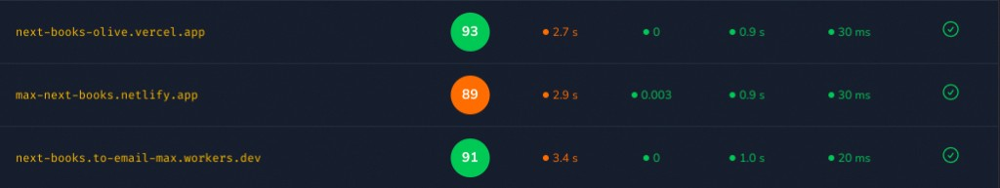

#### nuxt-books (streaming disabled)

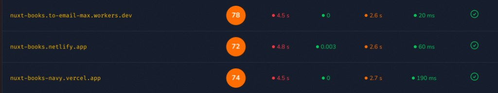

#### solid-books

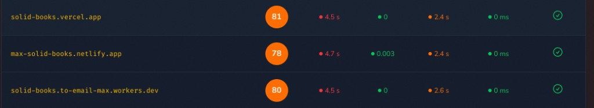

#### svelte-books

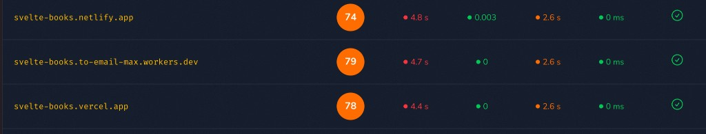

#### waku-books

#### pract-books (streaming disabled)

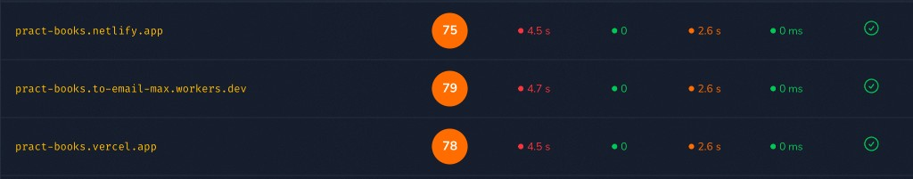

### CWV tests from 11/17/2026 with vite basic cache

#### next-books

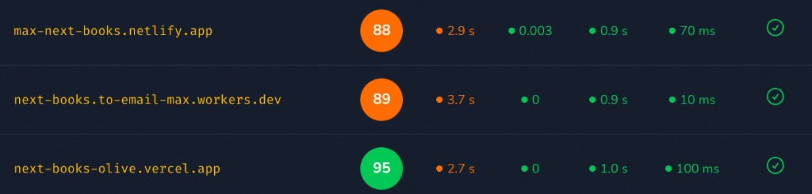

#### nuxt-books

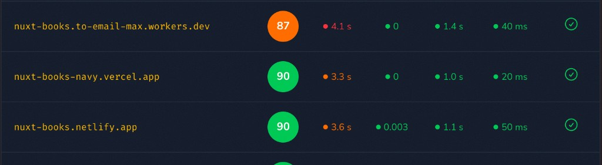

#### solid-books

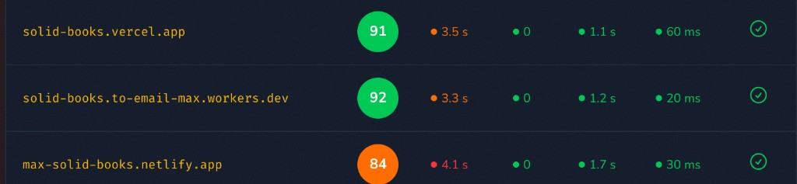

#### svelte-books

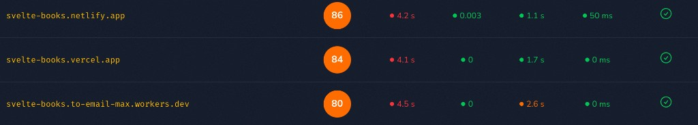

#### waku-books

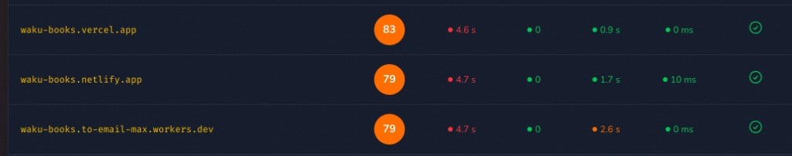

#### pract-books

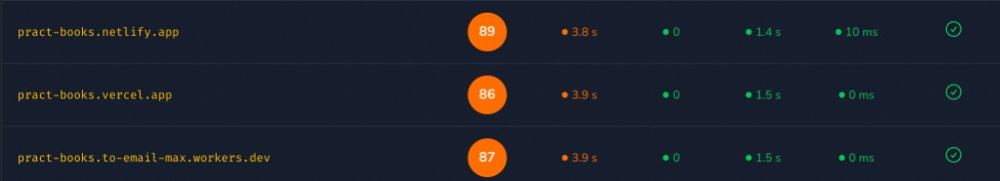